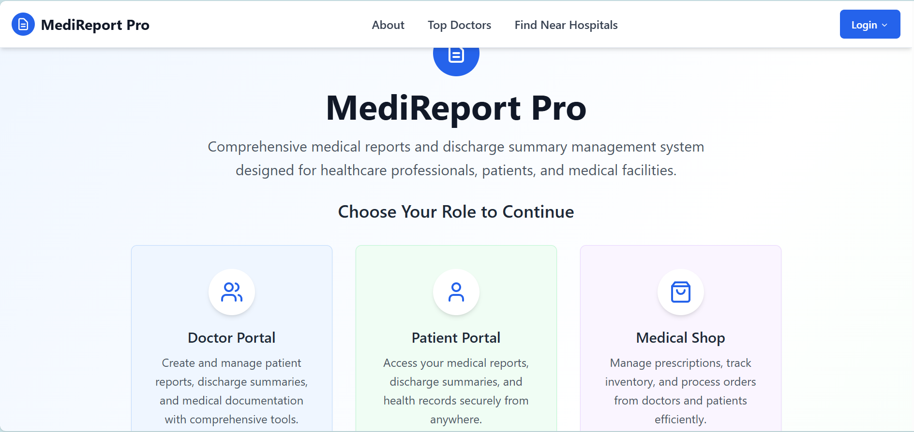
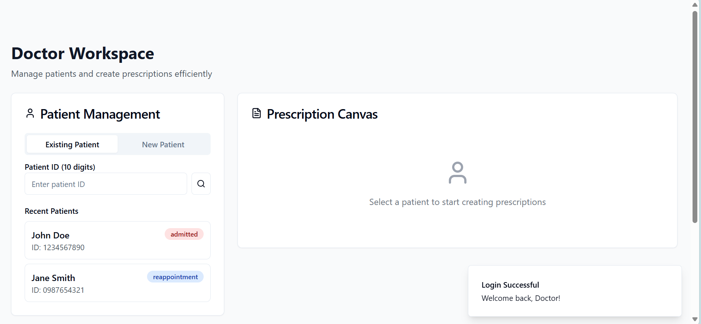
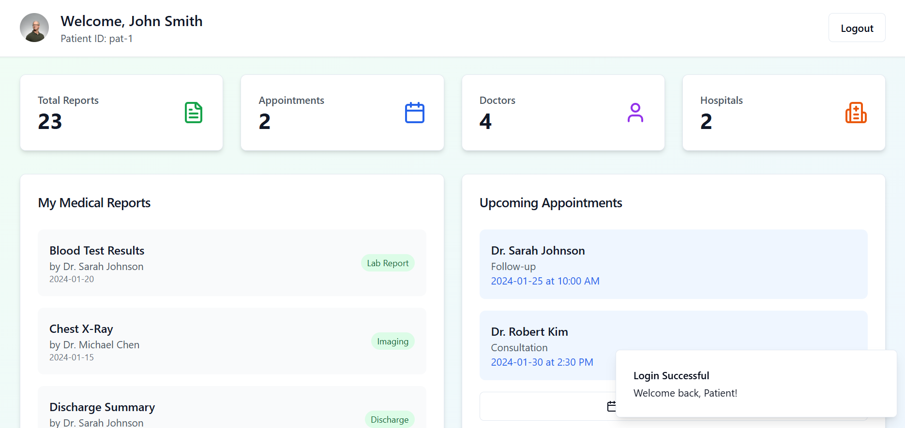

<h1 align="center">🧑‍⚕️MedXpert
</h1>
<h3 align="center">Digitializing the health industry by reducing time for IPD/OPD using AI and integration with Dwani API for regional language interaction with portal</h3>

<p align="center">
  
  
  
  
</p>

<h2 align="center">🧠 MedXpert — AI-powered Healthcare Assistant</h2>
<p align="center"><i>Your intelligent companion for smarter, faster medical diagnostics using Machine Learning.</i></p>

---

## 📸 UI Preview

Here are some screenshots that showcase the functionality and interface of **MediReport Pro**:

<p align="center">
  
  <br>
  <b>🧭 Homepage & Role Selection</b>  
  <br>
  Choose between Doctor, Patient, or Medical Shop portals with clean visual cards and intuitive layout.
</p>

<p align="center">
  
  <br>
  <b>🩺 Doctor Workspace</b>  
  <br>
  Allows doctors to manage existing or new patients and write prescriptions with an interactive UI.
</p>

<p align="center">
  
  <br>
  <b>👨‍⚕️ Patient Dashboard</b>  
  <br>
  Displays personalized patient data, past reports, doctor list, and upcoming appointments in a dashboard view.
</p>

## 🚀 Features

- 🧬 Predict fetal health using real patient data
- 📊 Classify as: Normal, Suspect, or Pathological
- 📂 Clean UI for medical input & form handling
- 📤 Auto-generated output with instant result
- ⚙️ Flask backend powered by a trained ML model
- 🔐 Fully local and secure — no cloud needed

---

## 💻 Tech Stack

| Component   | Technologies Used                                  |
|------------|-----------------------------------------------------|
| 🧠 AI/ML     |   |
| ⚙️ Backend  |   |
| 💻 Frontend |    |
| 📦 Storage  | Local JSON or CSV (optional DB support)            |
| 🎨 UI Icons | Feather Icons, Freepik 3D Assets                   |

---

## 📁 Folder Structure

```bash
MedXpert/
├── backend/              # Flask app with trained ML model
│   ├── app.py
│   ├── model.pkl
│   └── requirements.txt
│
├── frontend/             # Static frontend
│   ├── index.html
│   ├── style.css
│   └── script.js
│
├── assets/               # Images, icons, etc.
│   └── banner.png
│
└── README.md             # Project documentation
